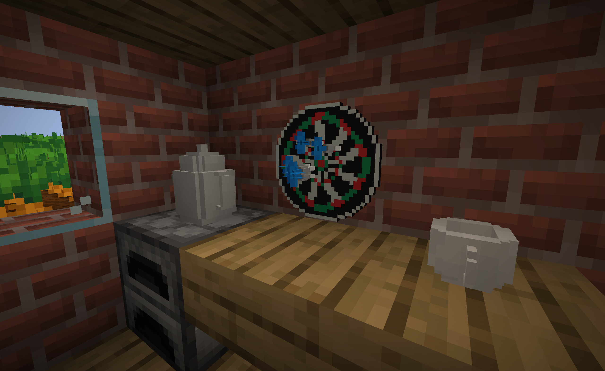
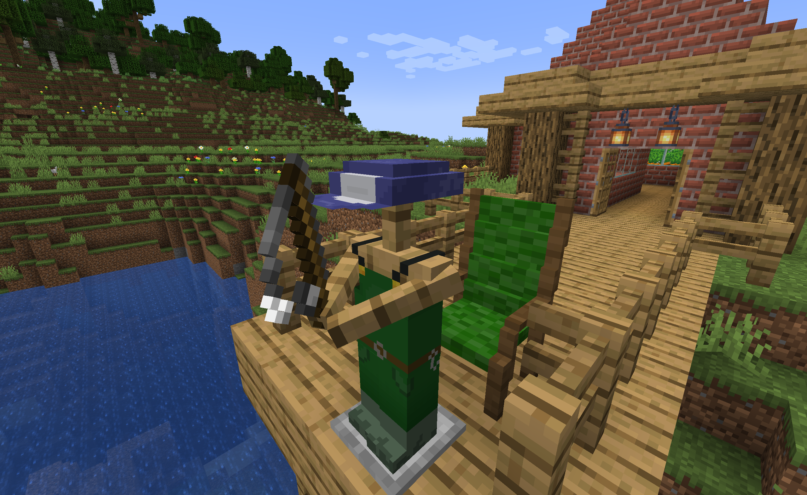

# Summer Cottage

Add some items from your cottage where you chilling out.

## Decorate

Your kitchen can be decorated with kettle and couple for tea, throw darts with a shaky hand.

## Put on your work clothes

Gardener's clothes will give you x2 drops from all crops, use the rake to plow and the watering can to grow 3x3 area.

Catch bigger and faster fish by wearing fisherman's clothes.

## Solstice day

Wait until the solstice day, which is usually in the middle of June, on this day your crops will grow much faster than usual.

## License

Distributed under the MIT License. See `LICENSE.txt` for more information.в